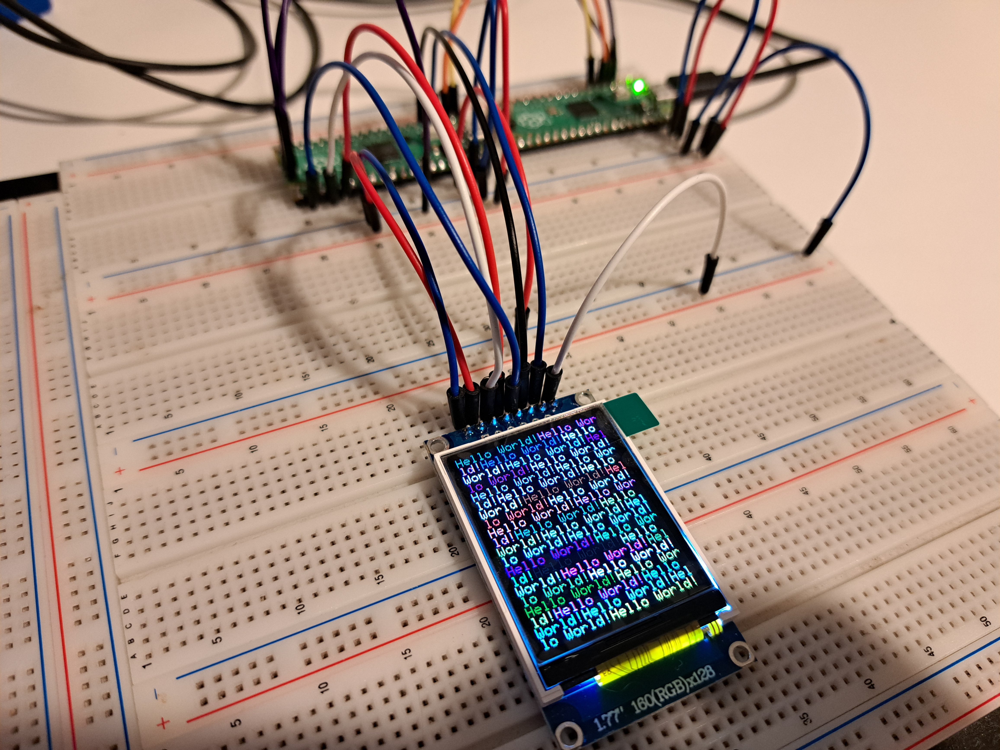

Hardware
----------------------

Connections as setup in main.cpp helloworld test file.

| TFT PinNum | Pindesc |  HW SPI | Pico PinNum
| --- | --- | --- | --- |
| 1 | GND | GND | 38 |
| 2 | VCC |  5.0V  | 39 |
| 3 | SCK | GPIO18 | 24 |
| 4 | SDA | GPIO19 | 25 |
| 5 | RES |   GPIO17 | 22 |
| 6 | RS |  GPIO3  | 5 |
| 7 | CS |  GPIO2 | 4 |
| 8 | LEDA | 3.3V | 36 |

1. NOTE connect LED backlight pin 1 thru a 150R/220R ohm resistor to 3.3/5V VCC.
2. This is a 3.3V logic device do NOT connect the I/O logic lines to 5V logic device.
3. You can connect VCC to 5V if there is a 3.3 volt regulator on back of TFT module.
4. SW SPI pick any GPIO you like , HW SPI SCLK and SDA will be tied to spio interface.
5. Backlight on/off control is left to user.

## Pictures
